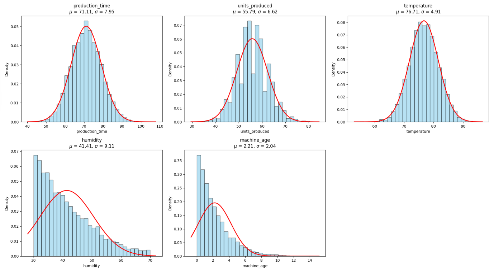

# Breakdown Analysis of Machinery

This project aims to analyze machine failure risk using machine learning methods and extended feature engineering. The Jupyter notebook (*breakdown analysis of machinery.ipynb*) demonstrates the entire process—from data preparation, through model building and calibration, to result interpretation.

## Table of Contents
1. [Prerequisites](#prerequisites)  
2. [Project Structure](#project-structure)  
3. [Analysis Steps Overview](#analysis-steps-overview)  
4. [Running the Project](#running-the-project)  
5. [Results](#results)  
6. [Next Steps](#next-steps)  

---

## Prerequisites

- **Python** version 3.7+ (3.8 or higher recommended).  
- A set of libraries used in the project, for example:
  - [NumPy](https://numpy.org/)
  - [pandas](https://pandas.pydata.org/)
  - [matplotlib](https://matplotlib.org/)
  - [scikit-learn](https://scikit-learn.org/stable/)
  - [imbalanced-learn (imblearn)](https://imbalanced-learn.org/)
  - [TensorFlow/Keras](https://www.tensorflow.org/)
  - [scipy.stats](https://docs.scipy.org/doc/scipy/reference/stats.html)

The easiest way to install the required libraries is to use a `requirements.txt` file (if included) or install packages manually:

```bash
pip install numpy pandas matplotlib scikit-learn imbalanced-learn tensorflow scipy
```

---

## Project Structure

A sample file structure for the project might look like this:

```
.
├── breakdown analysis of machinery.ipynb  # Main Jupyter notebook with the analysis
├── machine_downtimes_data.csv            # Data file (if using CSV data)                               # Example script for running the analysis
├── README.md                             # This README file
└── requirements.txt                      # (Optional) List of required libraries
```

---

## Analysis Steps Overview

1. **Data Loading**  
   - The notebook demonstrates how to load data from `machine_downtimes_data.csv`.  
   - The dataset includes basic machine features such as `production_time`, `units_produced`, `temperature`, `humidity`, `machine_age`, and a target variable `failure` (indicating whether a failure occurred).

2. **Extended Feature Engineering**  
   - Creation of new features, e.g., interactions between parameters, logarithmic transformations, polynomial features, etc.  
   - The goal is to enhance the signal in the data and help models detect patterns more effectively.

3. **Train/Test Split**  
   - Data is split into a training set (typically ~70–80%) and a test set (20–30%).  
   - Standard scaling (`StandardScaler`) is also applied to unify the scales of the features.

4. **Handling Imbalanced Data**  
   - Oversampling (e.g., ADASYN) is used to balance the number of observations with and without failures.  
   - A weighted loss function (cost-sensitive learning) is additionally employed during neural network training.

5. **Model Construction and Training**  
   - Two neural network models are created (with Dense layers, BatchNormalization, Dropout, etc.).  
   - Training uses callbacks (EarlyStopping, ReduceLROnPlateau) to avoid overfitting and optimize the learning process.

6. **Ensemble and Calibration**  
   - Final predictions are an average (*ensemble*) of both models.  
   - Isotonic Regression calibration and threshold optimization (based on the F1-score) improve classification quality.

7. **Analysis and Visualization of Results**  
   - Various metrics (confusion matrix, classification report, precision-recall curve, average precision) assess model performance.  
   - Additional plots (histograms with fitted normal distributions) help interpret key parameter distributions for machines with the lowest failure risk.

---

## Running the Project

1. **Clone the repository** (or download the project files):
   ```bash
   git clone <repository_url>
   cd <folder_name>
   ```

2. **Install dependencies**:
   ```bash
   pip install -r requirements.txt
   ```
   *(If `requirements.txt` is not provided, install the libraries manually.)*

3. **Launch Jupyter Notebook**:
   ```bash
   jupyter notebook
   ```
   Then open the file `breakdown analysis of machinery.ipynb` in your browser.


---

## Results



- **Precision-Recall Curve, F1-score**: Metrics for evaluating how effectively the model detects failures (class 1).  
- **Classification Report**: Precision, recall, and F1-score for each class.  
- **Confusion Matrix**: Shows the number of correct and incorrect classifications.  
- **Histograms and Feature Distributions**: Visual interpretation of which parameter ranges (e.g., temperature, humidity, machine age) are most common among the lowest-risk machines.

What is the result of this in practice?

production_time (μ = 71.1, σ = 7.55): Machines with a low probability of failure have production times clustered around about 71 units (e.g. minutes), with a typical deviation of about 7.55.

units_produced (μ = 57.0, σ = 6.62): The least failing machines produce an average of 57 units (with a standard deviation of 6.62).

temperature (μ = 70.1, σ = 4.91): For machines with a low risk of failure, the temperature stays around 70 degrees (with a deviation of about 5 degrees).

The graphs shown show histograms (bars) for two parameters - humidity (humidity) and machine age (machine_age) - in the group of machines with the lowest probability of failure. The red line is the fitted normal distribution curve with calculated mean (μμ) and standard deviation (σσ).

Humidity

    The mean (μμ) is approximately 41.41 and the standard deviation (σσ) is 9.11.
    The histogram suggests that humidity among these low-failure machines is most often in the region of 30-50, although it also reaches around 70.
    The distribution has a slightly ‘right tail’ (elongation on the right), as can be seen by the fact that values occur up to 70, but less frequently.

Machine age (machine_age)

    The mean (μμ) is approximately 2.21 and the standard deviation (σσ) is 2.04.
    The data clearly cluster closer to 0-2 years, and the older the machine, the fewer observations in this ‘low failure’ group.
    The histogram has a strong shift to the right (so-called rightward skewness), which often suggests that the normal distribution does not perfectly represent the true shape (distributions with a long tail to the right, e.g. close to exponential, are more typical for machine age).

How to interpret this?

    The average values tell you in which range the measurements most often fall among machines with a low risk of failure:
        Humidity around 40-50%.
        Machine age usually around 2 years (with a fairly wide dispersion).

    The standard deviation (σ) shows how widely the data are dispersed around the mean.
        For moisture content (σ ~ 9) means that values quite often can be both below 35% and above 45%.
        For age (σ ~ 2), it indicates that some of the machines in this group can be less than a year old and some as old as 4-5 years, although the older they are, the less often they end up in this ‘low failure’ group.

    Shape of the histogram:
        If the histogram is clearly skewed (as with machine_age), the normal distribution curve will only be an approximation.
        In the case of humidity, although there is also some skewness, the distribution is more ‘bell-shaped’ than for machine age.

In practice, this means that younger machines predominate among the machines with the lowest risk of failure (which is not surprising, as the age of the machine increases the probability of failure), and also the moisture content remains in moderate ranges (with a tendency towards values around 40-50%).

---

## Next Steps

- **Further hyperparameter tuning** (e.g., the number of layers and neurons in the network, learning rate, oversampling parameters).  
- **Enrich the feature set** with additional data (e.g., maintenance costs, maintenance type).  
- **Use other algorithms** (XGBoost, Random Forest, etc.) and compare them with neural network models.  
- **Cross-validation** for a more reliable model evaluation.

---